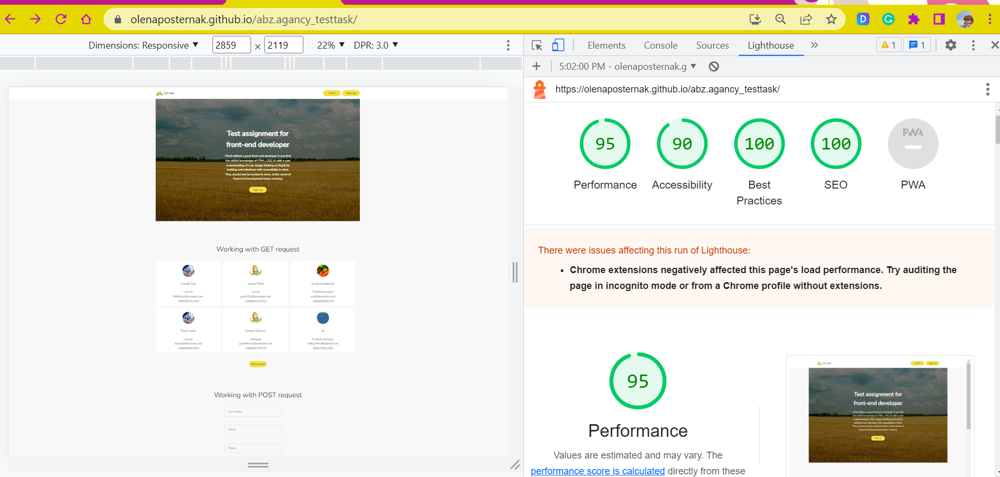
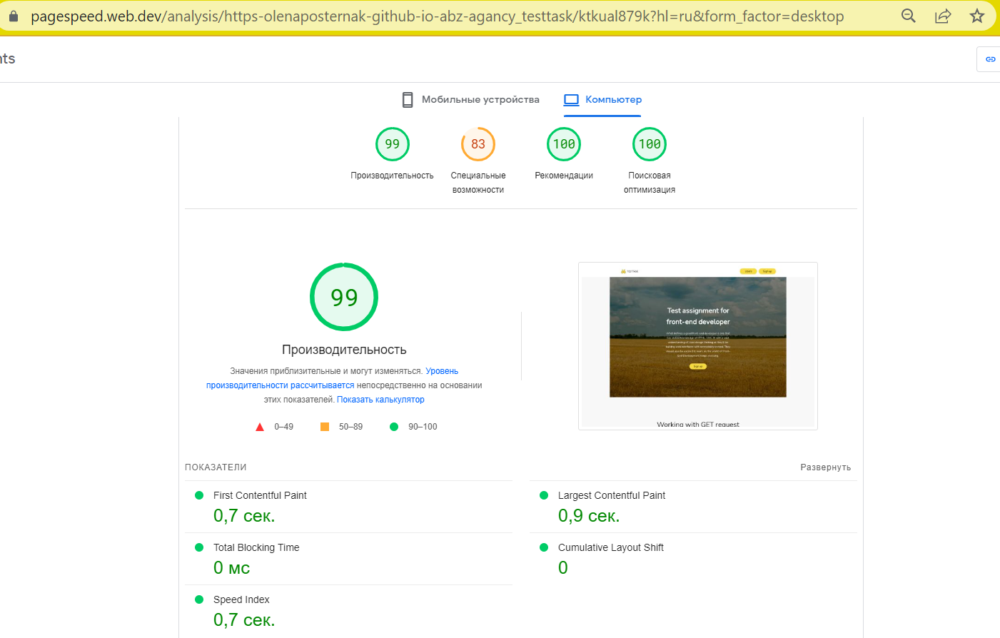

# ABZ Agency Test Task

This project is a web page that showcases a list of users fetched from a remote API, as part of a test task for ABZ Agency. It was built using React and Formik, and includes form validation using Yup.

Moreover, users can create a new card by adding such data as name, email, phone number, and photo.

## Form Validation
The user registration form included in the project uses Formik and Yup for validation. When the user submits the form, the validation schema defined in the validation Schema object is used to validate the input values. If there are any errors, they are displayed next to the corresponding fields.

## Here are some test performances:
 Lighthouse

Google Page Speed:

This project was built as part of a test task for ABZ Agency. The design was provided by ABZ Agency.